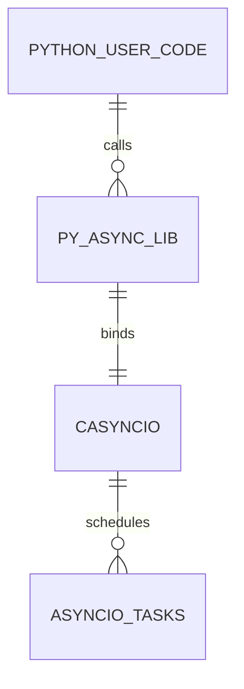
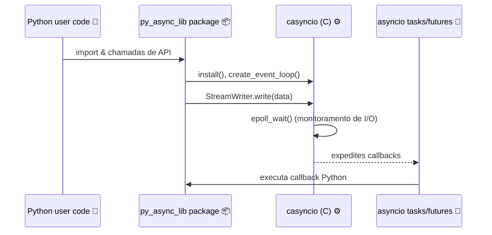
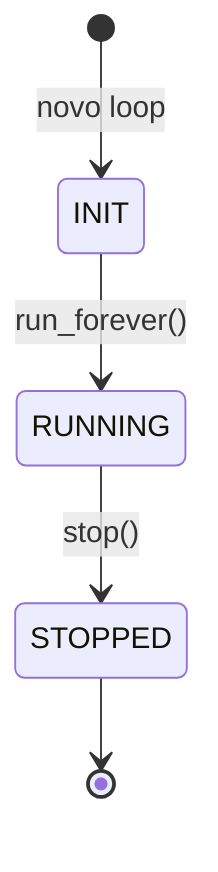

# py\_async\_lib

Minha própria implementação personalizada da biblioteca asyncio a partir do zero, usando Wrappers em C e Python.

## Benchmark

Você pode comparar a taxa de transferência do loop de eventos do projeto contra o loop `asyncio` embutido do Python com o script de benchmark:

```bash
PYTHONPATH=. python -m benchmarks.throughput  # exibe tempos de execução em segundos
```

Para usar o loop em C de alto desempenho com asyncio:

```python
import py_async_lib

py_async_lib.install()
```

### Executando os testes

Instale o pacote no modo editável e execute a suíte de testes com `pytest`:

```bash
pip install -e .
pytest
```

Os testes cobrem cada marco das issues **#1** a **#9**, incluindo o loop Python, o esqueleto em C, I/O watchers, helpers de subprocess e tratamento de sinais.

---

## 📚 Visão Geral da Arquitetura

A seguir, diagramas Mermaid ilustram como as peças se encaixam.

### ER Diagram (Entidades e Relacionamentos)



### Sequence Diagram (Fluxo de Chamadas)



### State Diagram (Estados do Loop de Eventos)



---

## Como Funciona

1. **Python user code** chama funções no pacote `py_async_lib`.
2. **py\_async\_lib** faz binding para o loop em C (`casyncio`).
3. **casyncio** gerencia um loop baseado em `epoll`, integrando timers, I/O e sinais.
4. Callbacks são enfileirados em **asyncio tasks/futures** para execução no contexto Python.

---

### Sequence Diagram: loop.\_c\_write

```mermaid
sequenceDiagram
    participant PyUser as Python
    participant Loop as EventLoop
    participant Slot as ensure_fdslot
    participant Buffer as OutBuf
    participant Writer as socket_write_now
    participant Epoll as epoll_ctl

    PyUser->>Loop: chama _c_write
    Loop->>Slot: ensure_fdslot(fd)
    Slot-->>Loop: retorna slot
    alt Buffer inexistente
        Loop->>Buffer: outbuf_new()
        Buffer-->>Loop: retorna obuf
    end
    Loop->>Writer: socket_write_now(fd, obuf)
    alt precisa aguardar
        Writer-->>Loop: retorno 1 (pending)
        Loop->>Epoll: epoll_ctl(ADD/MOD, fd, EPOLLOUT)
    else completou
        Writer-->>Loop: retorno 0 (complete)
    end
```

---

## Progresso de Desenvolvimento

* Estrutura inicial em Python e testes básicos (#1).
* Esqueleto em C, configuração de build (#2).
* `call_soon`, `run_forever` (#3).
* Temporizadores (`call_later`) (#4).
* Integração de I/O com `epoll` (#5).
* Escrita não bloqueante e back-pressure (#6).
* Cancelamento de tarefas e timeouts (#7).
* Tratamento de sinais e subprocessos (#8).
* Compatibilidade total com `asyncio` (#9).
* Otimizações finais e perfilamento (#10).
