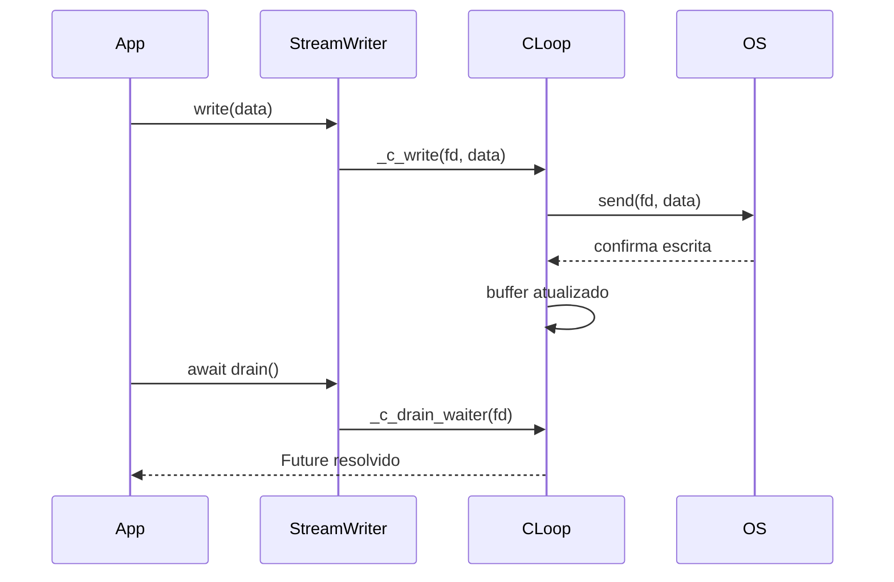
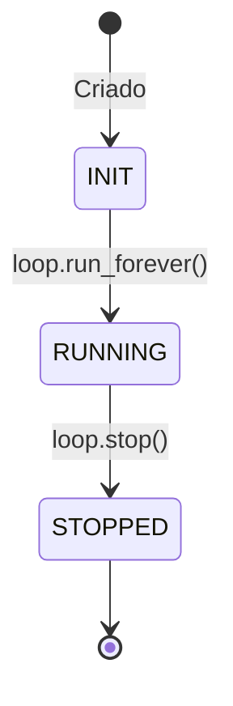

# 🌀 `py_async_lib`

Uma implementação própria da biblioteca `asyncio` feita do zero, com wrappers em C e Python.

## 🚀 Benchmark

Compare a performance do loop de eventos do projeto com o `asyncio` nativo:

```bash
PYTHONPATH=. python -m benchmarks.throughput  # imprime tempos de execução em segundos
```

Para usar o loop de alto desempenho:

```python
import py_async_lib
py_async_lib.install()
```

---

## 🧪 Testes

Instale o pacote em modo editável e execute os testes com `pytest`:

```bash
pip install -e .
pytest
```

Os testes cobrem cada marco das issues **#1** a **#9**, abrangendo o mini loop em Python, o esqueleto C, I/O, subprocessos e sinais.

---

## ⚙️ Arquitetura

### 📦 Diagrama de Componentes

```mermaid
componentDiagram
    component Python [
        Python 🐍
    ]
    component PyAsync [
        py_async_lib
    ]
    component CLoop [
        casyncio (C loop)
    ]
    component OS [
        Kernel: epoll/signalfd
    ]

    Python --> PyAsync : chamadas asyncio
    PyAsync --> CLoop : FFI/callbacks
    CLoop --> OS : epoll, sinais
```

---

### 🔁 Diagrama de Sequência (StreamWriter)



---

### 📈 Fluxo de Dados

```mermaid
flowchart TD
    A[Python Coroutine] --> B[StreamWriter.write()]
    B --> C[_c_write() (C)]
    C --> D[epoll loop]
    D --> E[Callback]
    E --> F[asyncio.Future set_result]
```

---

### 🧬 Diagrama de Estado do Event Loop



---

## 🧩 Estrutura do Projeto

```bash
py_async_lib/
├── stream_writer.py      # StreamWriter com write/drain
├── policy.py             # Política asyncio customizada
├── __init__.py           # Interface pública

project/
└── src/
    ├── loop.h            # Definições do loop C
    └── loopmodule.c      # Implementação do loop

benchmarks/
├── throughput.py         # Comparação com asyncio
└── validate.py           # Runner de benchmark

tests/
└── test_casyncio.py      # Testes funcionais

scripts/
├── massif.sh             # Valgrind
└── perf_flamegraph.sh    # Flamegraph via perf
```

---

## 📌 Progresso

* Event loop C implementado
* `OutBuf` gerencia escrita pendente
* `signalfd` integrado para lidar com sinais
