# py_async_lib

A custom implementation of the Python `asyncio` library from scratch, featuring a high-performance event loop written in C.

This project is an exploration into the low-level details of asynchronous programming, bridging Python's usability with C's performance. It replaces Python's default event loop with a custom `epoll`-based scheduler to handle I/O, timers, and signals efficiently.

## 📚 Architecture Overview

The library is composed of a Python frontend and a C backend. The Python layer provides a user-friendly API that mirrors `asyncio`, while the C extension (`casyncio`) implements the core event loop for maximum performance.

```mermaid
graph TD
    subgraph Python Space
        A[Python User Code 🐍] --> B(py_async_lib package);
        B --> |installs policy| C(asyncio);
        C --> |creates| D{asyncio tasks/futures 🗝};
    end

    subgraph C Extension
        E[casyncio.EventLoop ⚙️] --> |manages| F(epoll);
        E --> |executes| G[Callbacks];
    end

    B --> |calls into| E;
    G --> |sets result on| D;

    style A fill:#F9F,stroke:#333,stroke-width:2px
    style B fill:#F9F,stroke:#333,stroke-width:2px
    style C fill:#F9F,stroke:#333,stroke-width:2px
    style D fill:#F9F,stroke:#333,stroke-width:2px
    style E fill:#9FF,stroke:#333,stroke-width:2px
    style F fill:#9FF,stroke:#333,stroke-width:2px
    style G fill:#9FF,stroke:#333,stroke-width:2px
```



*   **Python User Code**: Your `async/await` code that uses the library.
*   **py_async_lib package**: The main Python package that provides the public API, such as `StreamWriter` and the `install()` function.
*   **asyncio tasks/futures**: Standard `asyncio` objects that represent the result of an asynchronous operation.
*   **casyncio.EventLoop**: The C implementation of the event loop that polls for I/O readiness using `epoll`.
*   **Callbacks**: Python functions scheduled to run when a specific event occurs (e.g., data received on a socket).

## 🔄 Data Flow: A Write Operation

This diagram shows the sequence of events when a user writes data to a stream.


1.  A coroutine calls `StreamWriter.write()`.
2.  The `StreamWriter` calls the loop's internal `_c_write` method, passing the file descriptor and data.
3.  The C loop attempts a non-blocking `send()`.
4.  If the kernel buffer is full, `send()` returns `EAGAIN`. The loop registers the file descriptor with `epoll` to be notified when it's ready for writing (`EPOLLOUT`).
5.  The `drain()` method creates a `Future` that will be resolved once the buffer is empty.
6.  When `epoll` reports the socket is writable, the loop writes the remaining data and resolves the `Future`.

## 📊 Event Loop State

The event loop operates as a simple state machine.


*   **INIT**: The initial state after `casyncio.EventLoop()` is created.
*   **RUNNING**: The loop enters this state when `run_forever()` is called. It continuously polls `epoll` for events and runs callbacks from its ready queue.
*   **STOPPED**: The `stop()` method sets a flag that causes the loop to exit the `RUNNING` state. The loop also stops if it has no more timers or I/O watchers to handle.

## ⚙️ Core C Structures

The relationships between the main C structures are key to the library's efficiency.


*   **`PyEventLoopObject`**: The central object that holds the `epoll` file descriptor (`epfd`), the queue of ready callbacks (`ready_q`), and a map of file descriptors to their corresponding callbacks (`fdmap`).
*   **`FDCallback`**: Stores the `reader` and `writer` callbacks for a single file descriptor.
*   **`OutBuf`**: A write buffer associated with an `FDCallback`. It holds the data to be written and a list of `Future` objects (`waiters`) to be notified upon successful drainage.

### Thread-safe callbacks

The loop exposes `call_soon_threadsafe()` to schedule callbacks from other threads. A self-pipe wakes the event loop so the function can be safely used from worker threads without race conditions.

### run_in_executor and async DNS

`py_async_lib.run_in_executor()` runs blocking functions in a thread pool and integrates with the event loop via `call_soon_threadsafe`. The helper `async_getaddrinfo()` wraps `socket.getaddrinfo` using this mechanism to perform non-blocking DNS lookups.

## 🚀 Benchmark

You can compare the throughput of the project's event loop against Python's built-in `asyncio` loop with the benchmark script:

```bash
PYTHONPATH=. python -m benchmarks.throughput
```

To use the high-performance C loop with `asyncio` in your own project:

```python
import py_async_lib
import asyncio

# Sets the default asyncio policy to use casyncio
py_async_lib.install()

# Now, any call to asyncio.new_event_loop() will return a casyncio.EventLoop
loop = asyncio.new_event_loop()
```

### 🧪 Running tests

Install the package in editable mode and run the test suite with `pytest`:

```bash
pip install -e .
pytest
```

The tests cover each development milestone, from the initial Python prototype to the C event loop, I/O watchers, and signal handling.

### 📈 Development Progress

The development of the C event loop is tracked through a series of issues, each representing a distinct feature:

*   **#1**: A prototype of a micro event loop purely in Python.
*   **#2**: The initial C skeleton, object structure, and build configuration.
*   **#3**: Implementation of `call_soon` and `run_forever`.
*   **#4**: Timer support via `call_later`.
*   **#5**: I/O integration using `epoll`.
*   **#6**: Handling of non-blocking writes and back-pressure.
*   **#7**: Support for task cancellation and timeouts.
*   **#8**: Management of OS signals and subprocesses.
*   **#9**: Full compatibility with the `asyncio` event loop policy.
*   **#10**: Profiling and final optimizations.
*   **#11**: Implementation of timers with `call_later`.
*   **#12**: Thread-safe callbacks (implemented).
*   **#13**: `run_in_executor` and async DNS resolution (implemented).
*   **#14**: High-level stream abstractions.
