# py_async_lib
My own custom implementation of the Ansycio library from scratch using C Wrappers and Python

## Example

Run the small loop demo in `examples/printer.py`:

```bash
PYTHONPATH=. python examples/printer.py
```

You can measure the loop's raw throughput with the benchmark script:

```bash
PYTHONPATH=. python -m benchmarks.throughput  # prints runtime in seconds
```

To use the high performance C loop with asyncio:

```python
import py_async_lib

py_async_lib.install()
```

### Running tests

Install the package in editable mode and run the test suite with `pytest`:

```bash
pip install -e .
pytest
```

The tests exercise each milestone from issues **#1** through **#9**, covering the
Python mini loop, the C event loop skeleton, I/O watchers, subprocess helpers and
signal handling.

### Development progress

The C event loop now includes an `OutBuf` structure for managing pending writes.
Signalfd integrated

## 📚 Architecture Overview

The library binds a tiny C event loop to Python so you can run high-performance asynchronous code. Below are some diagrams showing how the pieces fit together.

### 🏎️ Components

```mermaid
graph LR
    A["Python user code 🐍"] -->|uses| B(py_async_lib)
    B --> C(MiniLoop)
    B --> D(StreamWriter)
    B --> E(Subprocess)
    C -- FFI --> F(casyncio.EventLoop)
    D -- calls --> F
    E -- spawns --> F
```



### 🔄 Data Flow


### 📊 Event Loop State


